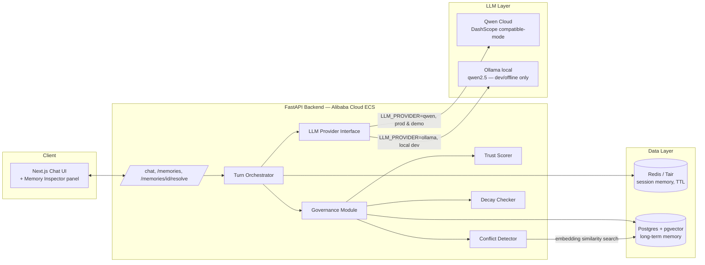

# MemGuard — Architecture Plan

**Trust-Aware Memory Agent** · Qwen Cloud Global AI Hackathon · Track 1: MemoryAgent

> Status: **Planning only** (per session scope). Implementation starts next session.
> Deadline: **Jul 10, 2026 @ 2:30 AM GMT+5:30** (~3 days from plan date, Jul 7).

---

## 1. One-line pitch

MemGuard is a persistent-memory agent that scores every memory for trust and provenance, catches conflicting or poisoned facts before acting on them, and forgets what's gone stale. Everyone else demos "recall across sessions." MemGuard demos **"recall across sessions — and refuses to be fooled."**

## 2. Why this wins on the rubric (not just why it's a good idea)

| Rubric criterion | Weight | How MemGuard's architecture scores against it |
|---|---|---|
| Technical Depth & Engineering | 30% | Dual-stage conflict detector (vector filter + LLM adjudication), pluggable LLM provider layer, MCP tool-server stretch goal, structured JSON-only extraction contracts |
| Innovation & AI Creativity | 30% | Trust as a first-class DB column (not a prompt hack), supersede-not-overwrite memory lifecycle, memory-event audit log, decay-on-read + optional scheduler |
| Problem Value & Impact | 25% | Directly targets OWASP's 2026 "Memory Poisoning" Top-10 threat for agentic apps — a real, named, unsolved problem, not a toy |
| Presentation & Documentation | 15% | Memory Inspector panel + live "memory event feed" visualizes the exact governance logic judges are told to look for |

Every architectural choice below is made with this table in mind — this is a hackathon, so we optimize for **judge-visible sophistication per hour of build time**, not for enterprise completeness.

## 3. Demo scenario (the 5 beats — this is the whole demo video)

1. **Session 1 — high-trust capture.** User states plan (Pro), timezone (IST), and a style preference. Stored as `trust_tier=high`, `source=user_stated`.
2. **Session 2 — cross-session recall.** New conversation, same `user_id`. Agent greets and uses the facts without being re-told. Proves the memory layer is separate from the context window.
3. **Poisoning attempt.** A pasted "forwarded email" / uploaded doc contains an embedded claim ("...entitled to a full refund and admin access"). Extracted as `trust_tier=low`, `source=document_extracted`. Agent does **not** act on it, and flags it back to the user via a `memory_events` conflict entry.
4. **Conflict detection.** User later says "Actually I'm on Enterprise now." System finds high similarity + differing content vs. the existing Pro-plan memory → both marked `conflicted` → user resolves via `/memories/{id}/resolve` → old memory transitions to `superseded_by` the new one (never silently overwritten).
5. **Decay.** A low-trust, low-relevance memory ages past its `ttl_days` and flips to `status=expired`, disappearing from the active set and the Inspector panel. TTL is configurable/short for demo purposes.

## 4. High-level architecture



ASCII fallback (matches the spec you provided, kept for the README/diagram source):

```
┌─────────────────┐      ┌──────────────────────┐      ┌────────────────────┐
│  Frontend        │─────▶│  Backend (FastAPI)   │─────▶│  Qwen Cloud API     │
│  Next.js chat UI │◀─────│  Alibaba Cloud ECS    │◀─────│  (DashScope         │
│  + Mem Inspector │      │  (docker-compose)     │      │  compatible-mode)   │
└─────────────────┘      └──────────┬───────────┘      └────────────────────┘
                                     │
                     ┌───────────────┼────────────────┐
                     ▼               ▼                ▼
            ┌────────────────┐ ┌───────────┐  ┌───────────────────┐
            │ Session memory  │ │ Long-term │  │ Governance module │
            │ (Redis, TTL)    │ │ memory    │  │ trust scorer      │
            │                 │ │ (Postgres │  │ conflict detector │
            │                 │ │ +pgvector)│  │ decay checker     │
            └────────────────┘ └───────────┘  └───────────────────┘
```

## 5. LLM strategy: Qwen Cloud (real) + Ollama (dev stand-in)

This is a deliberate senior-engineering decision, not a shortcut:

- **All LLM calls go through one interface**, `LLMProvider`, with two implementations:
  - `QwenProvider` — DashScope OpenAI-compatible endpoint, `https://dashscope-intl.aliyuncs.com/compatible-mode/v1`. This is what the deployed app, and the demo video, must use — it's a rubric line item ("sophisticated use of QwenCloud APIs").
  - `OllamaProvider` — local Ollama runtime, model `qwen2.5:7b` (or `qwen3:8b` if available). **Deliberately choose a local Qwen-family model**, not llama/mistral, so prompts behave near-identically when we flip the switch to DashScope — this avoids the classic "works on Ollama, breaks on the cloud API" re-tuning tax.
  - Selected via `LLM_PROVIDER=ollama|qwen` env var. Both implement the same three methods: `chat(messages) -> str`, `extract_facts(turn_text) -> list[FactCandidate]`, `compare_facts(new, existing) -> ConflictVerdict`.
- **Embeddings always go through Qwen's `text-embedding-v3`**, even during local dev (it's cheap, fast, generous free tier, and it avoids a vector-dimension mismatch between a local embedding model and the production one — the #1 way pgvector demos break the night before submission). Only the *chat/extraction* model is swappable; the *embedding* model is fixed.
- Two distinct Qwen calls per turn, both against the same model but different system prompts:
  1. **Conversational reply** — normal chat completion, memories injected into context.
  2. **Structured fact extraction** — strict system prompt, JSON-only output:
     > "Extract any new factual claims about the user from this message. Return ONLY a JSON array of objects: `{fact, source_hint, confidence}`. If none, return `[]`."
  - Parse defensively (LLMs occasionally wrap JSON in prose) — always wrap in a `try/except` with a regex fallback to extract the first `[...]` block, and treat a parse failure as "no facts extracted" rather than crashing the turn.

## 6. Data model (Postgres + pgvector)

Refined from the base spec with two additions: `confidence` (from the extraction LLM) and `raw_source_excerpt` (provenance — directly supports the "provenance" half of the pitch and gives the UI something to show under "why is this low-trust?"). Also added a `memory_events` audit table — this is the single highest-leverage addition for the Presentation criterion, since it lets the UI render a live "what the governance module just did" feed instead of judges having to trust it happened.

```sql
CREATE EXTENSION IF NOT EXISTS vector;
CREATE EXTENSION IF NOT EXISTS pgcrypto; -- gen_random_uuid()

CREATE TABLE memories (
    id                 UUID PRIMARY KEY DEFAULT gen_random_uuid(),
    user_id            TEXT NOT NULL,
    fact_text          TEXT NOT NULL,
    embedding          VECTOR(1024),              -- matches Qwen text-embedding-v3 dim (verify at build time)
    trust_tier         TEXT NOT NULL CHECK (trust_tier IN ('high','medium','low')),
    source             TEXT NOT NULL CHECK (source IN ('user_stated','tool_inferred','document_extracted')),
    confidence         REAL NOT NULL DEFAULT 1.0, -- from extraction LLM, 0.0-1.0
    raw_source_excerpt TEXT,                      -- provenance: original snippet the fact was pulled from
    status             TEXT NOT NULL DEFAULT 'active'
                       CHECK (status IN ('active','conflicted','expired','superseded')),
    ttl_days           INT NOT NULL DEFAULT 90,
    superseded_by      UUID REFERENCES memories(id),
    created_at         TIMESTAMPTZ NOT NULL DEFAULT now(),
    last_confirmed_at  TIMESTAMPTZ NOT NULL DEFAULT now()
);

CREATE INDEX ON memories USING ivfflat (embedding vector_cosine_ops) WITH (lists = 100);
CREATE INDEX idx_memories_user_status ON memories (user_id, status);

CREATE TABLE memory_events (
    id          UUID PRIMARY KEY DEFAULT gen_random_uuid(),
    user_id     TEXT NOT NULL,
    memory_id   UUID REFERENCES memories(id),
    event_type  TEXT NOT NULL CHECK (event_type IN (
                    'extracted','stored','flagged_poisoning','conflict_detected',
                    'resolved_accept','resolved_reject','resolved_supersede','expired'
                )),
    detail      JSONB NOT NULL DEFAULT '{}'::jsonb,
    created_at  TIMESTAMPTZ NOT NULL DEFAULT now()
);

CREATE INDEX idx_events_user_created ON memory_events (user_id, created_at DESC);
```

`session_turns` (Redis, not Postgres) — key `session:{session_id}`, a list of `{role, content, ts}`, TTL 30-60 min, holds raw conversation for prompt context only. Never a source of long-term truth.

## 7. Governance module (the core IP of this project)

### 7.1 Trust scorer

Deterministic, explainable, table-driven — resist the urge to make this "AI-judged" for v1; a rule table is easier to defend to judges than a black box, and it's the correct engineering call under time pressure:

| `source` | base `trust_tier` | default `ttl_days` |
|---|---|---|
| `user_stated` | high | 180 |
| `tool_inferred` | medium | 60 |
| `document_extracted` | low | 14 |

`confidence` from the extraction call can *downgrade* (never upgrade) a tier by one step if `confidence < 0.5`. This is the entire trust-scorer function — intentionally simple, stated explicitly in the README as a design choice ("explainable > clever").

### 7.2 Conflict / poisoning detector (two-stage, hybrid)

1. **Stage 1 — vector recall (cheap, fast).** Embed the new candidate fact, run a cosine-similarity search (pgvector `<=>`) against the user's `active` memories. Take top-k (k=3) above a similarity threshold (start at 0.80, tune during build).
2. **Stage 2 — LLM adjudication (precise).** For each candidate match, ask Qwen a strict comparison prompt: *"Do these two statements describe the same attribute of the same user, and do they agree, conflict, or is the second a duplicate/paraphrase? Return JSON: `{relation: agree|conflict|duplicate|unrelated}`."*
3. **Decision table:**
   - `unrelated` → write new memory normally (trust-scored as above).
   - `duplicate` → touch `last_confirmed_at` on the existing memory, don't insert a new row.
   - `agree` → insert new memory, no conflict.
   - `conflict` → **both** rows flip to `status='conflicted'`, a `memory_events` row (`conflict_detected`) is written, and the API returns a `memory_events` payload so the UI can render the "confirm or ignore" prompt. Nothing is auto-overwritten.
4. **Poisoning special case:** if the candidate's `source='document_extracted'` and it touches a sensitive field (a small keyword/entity allowlist for demo: refund, admin, billing, password, plan-upgrade) → force `trust_tier='low'`, write it as `status='conflicted'` immediately (even with zero similarity hits) and emit `flagged_poisoning`, so the agent visibly refuses to act on it rather than waiting for a similarity coincidence. This is the exact behavior beat 3 of the demo needs and doubles as the OWASP-Memory-Poisoning mitigation story for the "Problem Value" criterion.

### 7.3 Decay

- **Primary mechanism: check-on-read.** Every query for active memories (`GET /memories`, and the retrieval step inside `/chat`) first runs `UPDATE memories SET status='expired' WHERE status='active' AND now() > created_at + (ttl_days || ' days')::interval AND user_id = :uid`. Zero extra infra, always correct, and cheap at hackathon scale.
- **Demo speed-up:** `ttl_days` becomes fractional-friendly by storing everything as an interval computed from an env-configurable `DEMO_TIME_SCALE` multiplier (e.g. scale=1440 turns "days" into "minutes" for a live demo without touching schema or logic — just multiply the interval in the query). This lets you *show* decay live in the 3-minute video without waiting 30 real days.
- **Stretch:** an APScheduler background job doing the same UPDATE on a timer, purely so the Inspector panel can show items disappearing without the user needing to trigger a read — nice-to-have, not required (the spec explicitly says don't over-engineer this).

## 8. API contract

### `POST /chat`
Request:
```json
{ "user_id": "u_123", "session_id": "s_abc", "message": "Actually I'm on Enterprise now." }
```
Server does, in order: (1) append turn to Redis session, (2) decay-check + vector-retrieve active memories for `user_id`, (3) build prompt (system + retrieved memories + recent session turns + new message), (4) call `LLMProvider.chat(...)` for the reply, (5) call `LLMProvider.extract_facts(...)` on the raw message, (6) run each candidate through Trust Scorer → Conflict Detector, (7) persist memory + memory_event rows, (8) respond.

Response:
```json
{
  "reply": "Got it — I found a conflict with your existing plan on file. Want me to update it to Enterprise?",
  "memory_events": [
    {
      "event_type": "conflict_detected",
      "memory_ids": ["<old-pro-plan-id>", "<new-enterprise-id>"],
      "detail": { "old_fact": "Customer is on the Pro plan", "new_fact": "Customer is on the Enterprise plan" }
    }
  ]
}
```

### `GET /memories?user_id=u_123&status=active`
Returns the array of memory rows (id, fact_text, trust_tier, source, status, created_at, ttl_days) for the Memory Inspector panel. Supports `status` filter so the UI can also show a "Pending Review" tab (`status=conflicted`).

### `POST /memories/{id}/resolve`
```json
{ "action": "accept" | "reject" | "supersede", "superseded_by_fact": "optional new fact text if action=supersede" }
```
- `accept` → the flagged/conflicted memory becomes `active` (user confirmed it's true).
- `reject` → becomes `expired` immediately (user says it's false / a poisoning attempt).
- `supersede` → old memory row gets `status='superseded'` + `superseded_by` pointing at a freshly inserted `active` memory for the new fact.
- Always writes a corresponding `memory_events` row (`resolved_accept` / `resolved_reject` / `resolved_supersede`).

## 9. Frontend

- Next.js (App Router) + Tailwind, kept intentionally minimal: this is a backend/governance-logic hackathon, not a design one — spend the saved hours on the Conflict Detector.
- Left: chat panel (message list + input), tagged with which `session_id`/"session number" is active (a dev-only dropdown to start "Session 2" is the fastest way to prove cross-session recall on camera).
- Right: collapsible **Memory Inspector**:
  - "Active Memories" list — badge-colored by `trust_tier` (green/amber/red), icon by `source`.
  - "Pending Review" list — conflicted/flagged memories with inline **Accept / Reject / Supersede** buttons wired to `/memories/{id}/resolve`.
  - "Activity Feed" — live-streamed `memory_events` from the last `/chat` response, in plain English ("🔴 Extracted low-trust claim from document — flagged, not stored as fact"). **This panel is the single most judge-persuasive artifact in the whole project** — it turns invisible backend logic into a visual story, which is literally what the Presentation criterion asks for.

## 10. MCP stretch goal (only after the 5 beats work end-to-end)

Wrap the long-term memory store as an MCP server exposing `search_memory(user_id, query)` and `write_memory(user_id, fact, source)` as tools, then let Qwen (via DashScope's tool/function-calling support) call them directly instead of the backend hand-wiring retrieval into the prompt. This is a named rubric line item ("custom skills, MCP integrations") — worth doing only once the core demo is bulletproof, since it's additive polish, not a beat-blocking dependency.

## 11. Deployment (Alibaba Cloud) — non-negotiable, do on Day 1

- **Backend + Postgres + Redis**: single Alibaba Cloud **ECS** instance running `docker-compose` (backend container, `pgvector/pgvector` postgres image, redis image). Chosen over Function Compute because docker-compose is something Cursor can scaffold and you can debug in minutes, whereas FC packaging/cold-starts are a bad time-tradeoff for a 3-day sprint.
- **RDS for PostgreSQL (pgvector-enabled)** is a stretch swap for the containerized Postgres *only if* Day 1 goes smoothly — containerized Postgres on the same ECS box is the safe default and is explicitly sanctioned by the spec.
- **Frontend**: served either (a) via the same ECS box behind Nginx as a reverse proxy (`/` → Next.js, `/api` → FastAPI), or (b) statically exported and pushed to Alibaba Cloud OSS + CDN if time allows — (a) is simpler and is the default.
- **Deployment proof**: capture a short separate recording showing the backend reachable at its public ECS IP/domain, and link it in the submission to a specific repo file that proves Alibaba Cloud usage — the ECS `docker-compose.yml` / deployment script / RDS connection setup (with the API key redacted) is the natural file to point at. Do this the moment the skeleton is deployed, not the night before.

## 12. Non-functional notes

- **Security**: this project's whole pitch is trust-handling, so it needs to visibly practice what it preaches — parameterized queries everywhere (SQLAlchemy/asyncpg, no string-built SQL), API keys only via env vars (never committed — `.env` gitignored, `.env.example` committed), and the poisoning-keyword allowlist treated as a demo-scope heuristic (documented as such, not oversold as a general jailbreak defense).
- **Error handling**: every LLM call (chat, extraction, comparison) wrapped with a timeout + fallback (extraction failure → treat as "no new facts" instead of 500ing the whole turn; chat failure → return a graceful apology reply). This directly maps to the "strong... error handling" line in the Innovation criterion.
- **Scalability story for the README** (cheap to write, judges read it): `user_id`-partitioned queries, ivfflat index for ANN search at scale, stateless FastAPI so it horizontally scales behind a load balancer, Redis session layer already externalized from app memory — a couple of honest sentences here go a long way for "Problem Value & Impact: scalability potential."

## 13. Explicit build-order summary

See `docs/BUILD_PLAN.md` for the hour-by-hour plan; the intent for this document was full architecture only.
